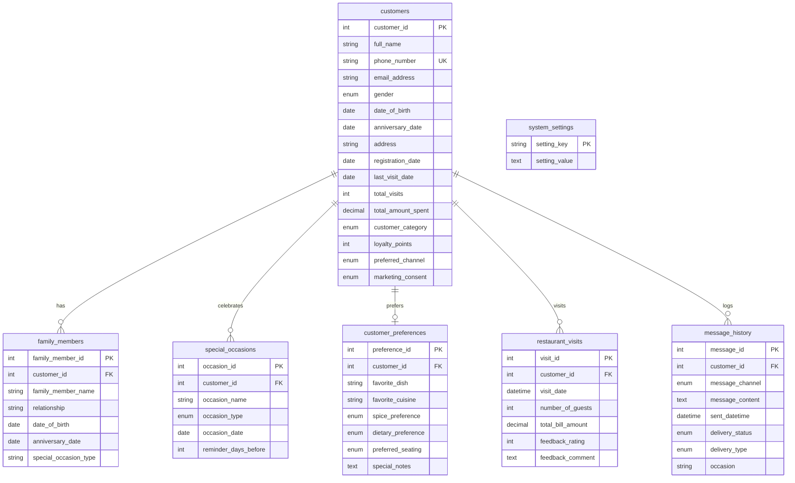

# 🍽️ Smart Dining CRM & Customer Engagement Portal

Welcome to the **Smart Dining CRM**, a state-of-the-art, high-performance Customer Relationship Management and engagement portal built on Python and Flask. This platform helps restaurant managers understand customer preferences, track dining history, categorize customers by loyalty tiers, and automate personalized marketing communications (via SMTP Email, SMS, or WhatsApp).

---

## ✨ Key Features

- **🏆 Dynamic Loyalty Tiering:** Automatically evaluates customer value (`New` ➡️ `Regular` ➡️ `VIP`) in real-time as restaurant visits and billing amounts are recorded.
- **🌟 Top 10 Customers Leaderboard:** Displays a live ranking of the top 10 customers based on cumulative **Loyalty Points** (earned automatically at 1 point per ₹10 spent) complete with rank medals (🥇, 🥈, 🥉) and customer engagement statistics (detailed counts of SMS, WhatsApp, and Email messages sent to each customer).
- **📅 Occasion Calendar & Automation:** Displays birthdays, anniversaries, and milestones for any chosen date. Allows managers to select recipients and dispatch greetings.
- **🔍 Advanced Customer Directory Filtering:** Dynamic client-side filters in the Customer Directory table allow managers to filter customers by category (VIP, Regular, New), total spending range (₹1,000 - ₹2,000, ₹2,000 - ₹4,000, and ₹4,000 - ₹10,000), and their `Last Visited` date.
- **🔍 Outbound Message Logs & Filtering:** A central messaging log where managers can view dispatch statuses and apply filters dynamically to isolate messages sent via **SMS**, **WhatsApp**, or **Email**, campaigns matching **Birthday Occasions** or **Anniversary Occasions**, or messages sent on a specific **Date**.
- **📨 Multi-Channel Communication:**
  - **SMTP Mail Client:** Built-in SMTP client with TLS/SSL encryption support to authenticate and send greetings.
  - **SMS Gateway:** Integration with Fast2SMS Bulk SMS API, plus a `simulated` mode for offline testing.
  - **WhatsApp Gateway:** Twilio WhatsApp API integration, allowing automated messages to customer WhatsApp numbers, plus a simulated logs mode.
- **🔍 360-Degree Customer Detail Drawer:** A slide-over drawer showing customer preferences (favorite cuisine, spice level, dietary preferences, seating requests), family member profiles, custom occasions, cumulative loyalty points, and a complete chronological timeline of historical visits.
- **⚙️ Integrated System Settings:** Save SMTP mail servers, SMS gateways, WhatsApp gateways, and custom templates directly into the database.
- **🛠️ Self-Installing Database Schema:** One-click database setup installer triggers to deploy the schema instantly.

---

## 🏗️ Technology Stack

1. **Backend:** Python 3.8+ (Flask web application).
2. **Frontend:** Vanilla HTML5 / JavaScript (ES6+ AJAX flow) & Google Fonts (`Outfit` & `Plus Jakarta Sans`).
3. **Styling:** Premium Custom CSS3 featuring variables, responsive layouts, sidebar navigation, custom scrollbars, micro-interactions, modal overlays, and modern glassmorphic aesthetics.
4. **Database:** MySQL 8.0+ (InnoDB engine, UTF-8 unicode encoding, optimized with indices).

---

## 📂 Project Structure

- 📄 [app.py](file:///c:/Users/Ratn%20Kumar%20Sharma/Desktop/smart_dining/app.py) — The primary router, backend logic handlers, database migrations, message clients, and Flask configuration.
- 📁 [static/](file:///c:/Users/Ratn%20Kumar%20Sharma/Desktop/smart_dining/static) — Custom modern UI styling script (`script.js`) and styles (`style.css`).
- 📁 [templates/](file:///c:/Users/Ratn%20Kumar%20Sharma/Desktop/smart_dining/templates) — Jinja2 HTML layout file (`index.html`).
- 📄 [smart_dining_crm.sql](file:///c:/Users/Ratn%20Kumar%20Sharma/Desktop/smart_dining/smart_dining_crm.sql) — Complete MySQL database schema.


---

## 🗄️ Database Schema

The database consists of 7 primary tables designed under relational database constraints:



---

## 🚀 Setup & Installation

### 📋 Prerequisites
- **Runtime:** Python 3.8+
- **Database:** **MySQL 8.0+** server running locally or remotely.
- **Python Libraries:** `flask`, `mysql-connector-python`

### 🛠️ Step-by-Step Installation

1. **Clone/Copy Project:** Move the project files into your working directory.
2. **Start MySQL Server:** Ensure MySQL is running on your machine.
3. **Database Configuration:** Open `app.py` and configure connection parameters in `get_db_connection` if they differ from local credentials:
   ```python
   'host': '127.0.0.1',
   'port': 3306,
   'user': 'root',
   'password': '',
   ```
4. **Install Dependencies:**
   ```bash
   pip install flask mysql-connector-python
   ```
5. **Run Application:**
   ```bash
   python app.py
   ```
6. **Schema Initialization:**
   - Launch your web browser and navigate to `http://127.0.0.1:5000/`.
   - The sidebar database status widget will detect that the database is uninitialized and display a yellow status bar.
   - Click the **"Initialize Database"** button to parse the `smart_dining_crm.sql` schema and seed settings.
   - Once initialized, the database status indicator becomes active.

---

## ⚙️ Configuration & Credentials

Management configurations can be adjusted inside the settings layout in the application interface:

### ✉️ SMTP Email Settings
If SMTP credentials are provided, the portal sends transactional emails via an encrypted TLS stream:
- **Default host:** `smtp.gmail.com` (Port `587`)
- **Sender account:** Configured in settings. Note that using Gmail SMTP requires an **App Password** instead of your primary account password.

### 📱 SMS Gateway
Two providers are configured under settings:
1. **Simulated:** Logs messages in the `message_history` database table but does not make network requests (perfect for demo systems).
2. **SMS Gateway:** Dispatches real SMS texts to Indian mobile numbers via Firebase Cloud Functions endpoint (`https://us-central1-sms-gateway-ae7e1.cloudfunctions.net/api_sms_send`).
   - Phone numbers are automatically formatted into E.164 (`+91XXXXXXXXXX`).
   - Requires a valid API Token (pre-configured to developer test keys).
   - *Test Tool:* Use the **"Send Test SMS"** feature in the settings panel to verify connection parameters before executing client campaigns.

---

## 📊 CRM Workflow & Guide

### 1. Loyalty Tiers Calculation
The system calculates tiers upon recording a guest visit:
- 👑 **VIP:** Lifetime spend $\ge$ ₹10,000 OR Total Visits $\ge$ 10.
- ⭐ **Regular:** Lifetime spend $\ge$ ₹3,000 OR Total Visits $\ge$ 4.
- 🌱 **New:** Defaults for any registered customer below the criteria.

### 2. Custom Templates
Manage default messages in settings:
- Use placeholder `{name}` which will be automatically replaced with the customer's full name when sending.
- Separate templates exist for **Birthdays** and **Anniversaries**.

### 3. Customer Lifecycle Management

1. **Register:** Add customers with key details (birthday, anniversary, preferences) and optional family member information.
2. **Visit Log:** Record visits, guest count, bill amount, ratings, and feedback.
3. **Analyze:** View customer profiles, preferences, and visit history from the Customers Directory.
4. **Campaigns:** Run occasion-based campaigns and send personalized SMS/Email promotions.
---

## 📜 License & Acknowledgments

- **UI Toolkit:** Designed using custom modern CSS, including custom glassmorphic panels and responsive grids.
- Built for seamless performance, modern responsive aesthetics, and comprehensive customer lifecycle management.
